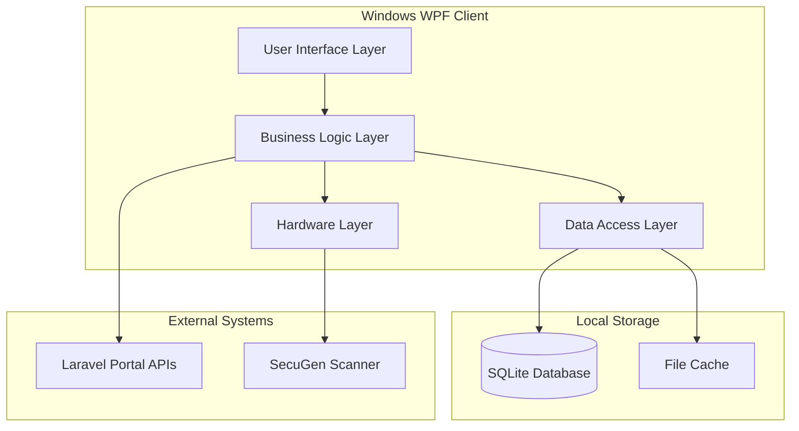

# Design Document: BACT Biometric API Integration

## Overview

This design document outlines the enhancement of the existing Windows WPF biometric client application to properly integrate with the Laravel backend portal for the BACT admission system. The design focuses on creating a robust, offline-first application that supports role-based biometric operations with seamless synchronization capabilities.

The enhanced Windows client will provide two distinct user experiences: a registration interface for Biometric Operators to capture student fingerprints across multiple colleges, and a verification interface for College Admins to verify student identities within their assigned college. The application will maintain full functionality during network outages through local SQLite caching and queue-based synchronization.

## Architecture

### High-Level Architecture



### Layered Architecture Design

**Presentation Layer (UI)**
- Role-based WPF views (Registration/Verification)
- MVVM pattern implementation
- Real-time status indicators and progress feedback
- Responsive design for various screen sizes

**Business Logic Layer**
- Authentication and session management
- Role-based access control
- Offline-first operation logic
- Synchronization orchestration
- Fingerprint processing workflows

**Data Access Layer**
- SQLite database operations
- API communication services
- Caching strategies
- Queue management for offline operations

**Hardware Integration Layer**
- SecuGen SDK integration
- Fingerprint capture and processing
- Hardware error handling and recovery

## Components and Interfaces

### Core Services

#### AuthenticationService
```csharp
public interface IAuthenticationService
{
    Task<LoginResult> LoginAsync(string email, string password);
    Task<bool> LogoutAsync();
    Task<bool> RefreshTokenAsync();
    Task<bool> ValidateTokenAsync();
    User GetCurrentUser();
    bool IsAuthenticated { get; }
}
```

#### ApiService
```csharp
public interface IApiService
{
    Task<ApiResponse<T>> GetAsync<T>(string endpoint);
    Task<ApiResponse<T>> PostAsync<T>(string endpoint, object data);
    Task<ApiResponse<T>> PutAsync<T>(string endpoint, object data);
    Task<ApiResponse<T>> DeleteAsync<T>(string endpoint);
    bool IsOnline { get; }
    event EventHandler<NetworkStatusChangedEventArgs> NetworkStatusChanged;
}
```

#### DatabaseService
```csharp
public interface IDatabaseService
{
    Task<List<Student>> GetStudentsAsync(int collegeId);
    Task<Student> GetStudentByRollNumberAsync(string rollNumber);
    Task SaveStudentAsync(Student student);
    Task<List<QueuedOperation>> GetPendingOperationsAsync();
    Task SaveOperationAsync(QueuedOperation operation);
    Task MarkOperationSyncedAsync(int operationId);
}
```

#### SynchronizationService
```csharp
public interface ISynchronizationService
{
    Task<SyncResult> SyncAllAsync();
    Task<SyncResult> SyncRegistrationsAsync();
    Task<SyncResult> SyncVerificationsAsync();
    Task<bool> DownloadStudentsAsync(int collegeId);
    event EventHandler<SyncProgressEventArgs> SyncProgress;
}
```

#### FingerprintService
```csharp
public interface IFingerprintService
{
    Task<bool> InitializeScannerAsync();
    Task<FingerprintCaptureResult> CaptureAsync();
    Task<MatchResult> MatchAsync(byte[] template1, byte[] template2);
    bool IsScannerConnected { get; }
    event EventHandler<ScannerStatusEventArgs> ScannerStatusChanged;
}
```

### Data Models

#### User Model
```csharp
public class User
{
    public int Id { get; set; }
    public string Name { get; set; }
    public string Email { get; set; }
    public UserRole Role { get; set; }
    public int? AssignedCollegeId { get; set; }
    public List<College> AssignedColleges { get; set; }
    public DateTime LastLoginAt { get; set; }
}

public enum UserRole
{
    Operator,
    CollegeAdmin
}
```

#### Student Model
```csharp
public class Student
{
    public int Id { get; set; }
    public string RollNumber { get; set; }
    public string Name { get; set; }
    public string FatherName { get; set; }
    public string CNIC { get; set; }
    public string Gender { get; set; }
    public int TestId { get; set; }
    public string TestName { get; set; }
    public int CollegeId { get; set; }
    public string CollegeName { get; set; }
    public byte[] Picture { get; set; }
    public byte[] FingerprintTemplate { get; set; }
    public byte[] FingerprintImage { get; set; }
    public int? FingerprintQuality { get; set; }
    public DateTime? FingerprintRegisteredAt { get; set; }
    public SyncStatus SyncStatus { get; set; }
}
```

#### QueuedOperation Model
```csharp
public class QueuedOperation
{
    public int Id { get; set; }
    public OperationType Type { get; set; }
    public string Data { get; set; }
    public DateTime CreatedAt { get; set; }
    public int SyncAttempts { get; set; }
    public string LastError { get; set; }
    public SyncStatus Status { get; set; }
}

public enum OperationType
{
    FingerprintRegistration,
    FingerprintVerification
}

public enum SyncStatus
{
    Pending,
    Syncing,
    Synced,
    Failed
}
```

### User Interface Components

#### MainWindow
- Navigation between Registration and Verification tabs based on user role
- Status bar showing online/offline status and sync progress
- User information display and logout functionality

#### RegistrationView (Biometric Operators)
- College selection dropdown
- Student search functionality
- Fingerprint capture interface
- Registration queue status

#### VerificationView (College Admins)
- Student search for verification
- Fingerprint matching interface
- Verification result recording
- Verification history

#### Common UI Components
- StudentSearchControl: Reusable student search with filtering
- FingerprintCaptureControl: Fingerprint capture with quality feedback
- SyncStatusControl: Real-time synchronization status display
- ProgressIndicator: Operation progress feedback

## Data Models

### SQLite Database Schema

```sql
-- Users table for caching login information
CREATE TABLE users (
    id INTEGER PRIMARY KEY,
    name TEXT NOT NULL,
    email TEXT UNIQUE NOT NULL,
    role TEXT NOT NULL,
    assigned_college_id INTEGER,
    token TEXT,
    token_expires_at TEXT,
    last_login_at TEXT,
    created_at TEXT DEFAULT CURRENT_TIMESTAMP
);

-- Colleges table for caching college information
CREATE TABLE colleges (
    id INTEGER PRIMARY KEY,
    name TEXT NOT NULL,
    district TEXT,
    is_active INTEGER DEFAULT 1,
    created_at TEXT DEFAULT CURRENT_TIMESTAMP
);

-- User-college assignments for operators
CREATE TABLE user_colleges (
    user_id INTEGER,
    college_id INTEGER,
    PRIMARY KEY (user_id, college_id),
    FOREIGN KEY (user_id) REFERENCES users(id),
    FOREIGN KEY (college_id) REFERENCES colleges(id)
);

-- Students table for offline caching
CREATE TABLE students (
    id INTEGER PRIMARY KEY,
    roll_number TEXT UNIQUE NOT NULL,
    name TEXT NOT NULL,
    father_name TEXT,
    cnic TEXT,
    gender TEXT,
    test_id INTEGER,
    test_name TEXT,
    college_id INTEGER,
    college_name TEXT,
    picture BLOB,
    fingerprint_template BLOB,
    fingerprint_image BLOB,
    fingerprint_quality INTEGER,
    fingerprint_registered_at TEXT,
    sync_status TEXT DEFAULT 'synced',
    last_updated TEXT DEFAULT CURRENT_TIMESTAMP,
    FOREIGN KEY (college_id) REFERENCES colleges(id)
);

-- Queued operations for offline sync
CREATE TABLE queued_operations (
    id INTEGER PRIMARY KEY AUTOINCREMENT,
    operation_type TEXT NOT NULL,
    operation_data TEXT NOT NULL,
    created_at TEXT DEFAULT CURRENT_TIMESTAMP,
    sync_attempts INTEGER DEFAULT 0,
    last_error TEXT,
    sync_status TEXT DEFAULT 'pending'
);

-- Verification results cache
CREATE TABLE verification_results (
    id INTEGER PRIMARY KEY AUTOINCREMENT,
    roll_number TEXT NOT NULL,
    student_id INTEGER,
    match_result TEXT NOT NULL,
    confidence_score REAL,
    entry_allowed INTEGER,
    verified_at TEXT,
    verified_by TEXT,
    remarks TEXT,
    sync_status TEXT DEFAULT 'pending',
    FOREIGN KEY (student_id) REFERENCES students(id)
);

-- Application settings
CREATE TABLE app_settings (
    key TEXT PRIMARY KEY,
    value TEXT,
    updated_at TEXT DEFAULT CURRENT_TIMESTAMP
);

-- Indexes for performance
CREATE INDEX idx_students_roll_number ON students(roll_number);
CREATE INDEX idx_students_college_id ON students(college_id);
CREATE INDEX idx_students_sync_status ON students(sync_status);
CREATE INDEX idx_queued_operations_status ON queued_operations(sync_status);
CREATE INDEX idx_verification_results_sync_status ON verification_results(sync_status);
```

### API Integration Models

#### API Response Wrapper
```csharp
public class ApiResponse<T>
{
    public bool Success { get; set; }
    public string Message { get; set; }
    public T Data { get; set; }
    public Dictionary<string, List<string>> Errors { get; set; }
}
```

#### Login Response
```csharp
public class LoginResponse
{
    public string Token { get; set; }
    public User User { get; set; }
    public List<College> Colleges { get; set; }
    public UserPermissions Permissions { get; set; }
}

public class UserPermissions
{
    public bool CanRegister { get; set; }
    public bool CanVerify { get; set; }
}
```

#### Sync Request Models
```csharp
public class BulkRegistrationRequest
{
    public List<FingerprintRegistration> Registrations { get; set; }
}

public class FingerprintRegistration
{
    public string RollNumber { get; set; }
    public string FingerprintTemplate { get; set; }
    public string FingerprintImage { get; set; }
    public int QualityScore { get; set; }
    public DateTime CapturedAt { get; set; }
}

public class BulkVerificationRequest
{
    public List<FingerprintVerification> Verifications { get; set; }
}

public class FingerprintVerification
{
    public string RollNumber { get; set; }
    public string MatchResult { get; set; }
    public double ConfidenceScore { get; set; }
    public bool EntryAllowed { get; set; }
    public DateTime VerifiedAt { get; set; }
    public string Remarks { get; set; }
}
```

Now I need to use the prework tool to analyze the acceptance criteria before writing the Correctness Properties section.

<function_calls>
<invoke name="prework">
<parameter name="featureName">biometric-api-integration

## Correctness Properties

*A property is a characteristic or behavior that should hold true across all valid executions of a system-essentially, a formal statement about what the system should do. Properties serve as the bridge between human-readable specifications and machine-verifiable correctness guarantees.*

### Property 1: API Integration Consistency
*For any* API call made by the Windows Client, the request should use the correct base URL structure and include proper authentication headers when required.
**Validates: Requirements 1.1, 1.3**

### Property 2: JSON Response Parsing Reliability
*For any* API response received from the Laravel Portal, the Windows Client should successfully parse the JSON structure without errors.
**Validates: Requirements 1.2**

### Property 3: Network Error Recovery
*For any* network error encountered during API communication, the Windows Client should implement appropriate retry logic and provide meaningful error feedback.
**Validates: Requirements 1.4**

### Property 4: Authentication Token Lifecycle Management
*For any* authentication token, the Windows Client should securely store it, detect expiration, and handle refresh or re-authentication appropriately.
**Validates: Requirements 2.1, 2.2, 2.5**

### Property 5: Authentication Data Cleanup
*For any* logout operation, the Windows Client should completely clear all stored authentication data and invalidate tokens.
**Validates: Requirements 2.4**

### Property 6: Role-Based Interface Adaptation
*For any* user login, the Windows Client should display the appropriate interface (registration or verification) based on the user's role and hide unauthorized functionality.
**Validates: Requirements 3.1, 3.2, 3.3**

### Property 7: College Data Filtering
*For any* data request, the Windows Client should only display students and information from colleges assigned to the current user.
**Validates: Requirements 3.4, 5.3**

### Property 8: Offline Operation Continuity
*For any* network connectivity loss, the Windows Client should continue operating using cached data and queue all operations for later synchronization.
**Validates: Requirements 4.2, 4.3**

### Property 9: Automatic Synchronization Trigger
*For any* network connectivity restoration, the Windows Client should automatically detect availability and initiate synchronization of queued operations.
**Validates: Requirements 4.4, 9.1**

### Property 10: Data Caching Consistency
*For any* online operation, the Windows Client should download and cache essential data locally, and refresh stale cache when necessary.
**Validates: Requirements 4.1, 4.5**

### Property 11: Local Search Performance
*For any* student search operation, the Windows Client should use cached SQLite data and return results quickly without requiring network access.
**Validates: Requirements 5.1**

### Property 12: Student Data Display Completeness
*For any* student record displayed, the Windows Client should show all required fields including photo, personal information, and biometric status.
**Validates: Requirements 5.2**

### Property 13: Dual Update Consistency
*For any* student record update, the Windows Client should update both the local cache and queue the change for server synchronization.
**Validates: Requirements 5.4**

### Property 14: Scanner Hardware Integration
*For any* application startup, the Windows Client should detect and initialize connected SecuGen fingerprint scanners properly.
**Validates: Requirements 6.1**

### Property 15: Fingerprint Quality Feedback
*For any* fingerprint capture operation, the Windows Client should provide real-time quality feedback and prompt for recapture when quality is insufficient.
**Validates: Requirements 6.2, 6.3**

### Property 16: Biometric Data Format Conversion
*For any* successfully captured fingerprint, the Windows Client should convert templates and images to Base64 format for storage and transmission.
**Validates: Requirements 6.4**

### Property 17: Registration Workflow Guidance
*For any* fingerprint registration process, the Windows Client should guide the operator through clear steps and validate quality before saving.
**Validates: Requirements 7.1, 7.2**

### Property 18: Registration Data Persistence
*For any* fingerprint registration, the Windows Client should store the data locally and queue it for server synchronization.
**Validates: Requirements 7.3**

### Property 19: Verification Template Loading
*For any* student verification request, the Windows Client should load the stored fingerprint template and perform local matching against live capture.
**Validates: Requirements 8.1, 8.2**

### Property 20: Verification Result Display
*For any* verification operation, the Windows Client should display match confidence scores, recommended decisions, and record results for synchronization.
**Validates: Requirements 8.3, 8.4**

### Property 21: Batch Synchronization Processing
*For any* synchronization operation with multiple queued items, the Windows Client should process uploads in batches to prevent timeouts and memory issues.
**Validates: Requirements 9.2**

### Property 22: Synchronization Failure Handling
*For any* synchronization operation that encounters failures, the Windows Client should retry failed items and provide detailed error reporting.
**Validates: Requirements 9.3**

### Property 23: Post-Synchronization Cleanup
*For any* successful synchronization, the Windows Client should update local records to reflect successful uploads and clear the sync queue.
**Validates: Requirements 9.4**

### Property 24: User Feedback Consistency
*For any* operation in progress or completion, the Windows Client should provide clear progress indicators, status updates, and confirmation messages.
**Validates: Requirements 10.1, 10.4**

### Property 25: Network Status Indication
*For any* network connectivity change, the Windows Client should update status indicators to clearly show online/offline state.
**Validates: Requirements 10.3**

### Property 26: Comprehensive Error Handling
*For any* error condition (expected or unexpected), the Windows Client should display user-friendly messages, log detailed information, and provide recovery options.
**Validates: Requirements 7.5, 10.2, 10.5**

## Error Handling

### Network Error Handling
The Windows Client must gracefully handle various network conditions:

**Connection Failures**
- Detect network unavailability and switch to offline mode
- Queue operations for later synchronization
- Provide clear feedback about offline status
- Retry failed requests with exponential backoff

**API Errors**
- Parse and display meaningful error messages from Laravel Portal
- Handle HTTP status codes appropriately (401, 403, 404, 500)
- Implement proper error recovery workflows
- Log errors for debugging and support

**Timeout Handling**
- Set appropriate timeouts for different operation types
- Cancel long-running operations gracefully
- Provide user options to retry or cancel
- Maintain application responsiveness during network delays

### Hardware Error Handling
The application must handle SecuGen scanner issues:

**Scanner Detection Failures**
- Detect when scanners are disconnected
- Provide clear instructions for reconnection
- Retry scanner initialization automatically
- Fallback options when hardware is unavailable

**Capture Quality Issues**
- Validate fingerprint quality in real-time
- Guide users for better positioning and pressure
- Implement automatic recapture for poor quality
- Set minimum quality thresholds for acceptance

### Data Integrity Error Handling
Ensure data consistency across offline/online operations:

**Synchronization Conflicts**
- Detect conflicts between local and server data
- Provide conflict resolution options to users
- Maintain audit trails for conflict resolution
- Prevent data loss during conflict resolution

**Database Errors**
- Handle SQLite database corruption gracefully
- Implement database repair and recovery mechanisms
- Backup critical data before major operations
- Provide data export options for recovery

## Testing Strategy

### Dual Testing Approach
The testing strategy employs both unit testing and property-based testing to ensure comprehensive coverage:

**Unit Testing Focus:**
- Specific examples and edge cases for each component
- Integration points between services and UI components
- Error conditions and recovery scenarios
- Hardware integration with mock SecuGen devices
- Database operations with test SQLite instances

**Property-Based Testing Focus:**
- Universal properties that hold across all valid inputs
- Comprehensive input coverage through randomization
- Validation of correctness properties defined in this document
- Stress testing with large datasets and concurrent operations

### Property-Based Testing Configuration
- **Testing Framework:** Use FsCheck for C#/.NET property-based testing
- **Test Iterations:** Minimum 100 iterations per property test to ensure statistical confidence
- **Test Tagging:** Each property test must reference its design document property using the format:
  ```csharp
  [Property]
  [Tag("Feature: biometric-api-integration, Property 1: API Integration Consistency")]
  public bool ApiCallsUseCorrectUrlStructure(ApiRequest request) { ... }
  ```

### Testing Categories

**Authentication and Session Management Tests**
- Token storage and retrieval security
- Token expiration detection and refresh
- Role-based access control enforcement
- Session persistence across application restarts

**Offline-First Functionality Tests**
- Data caching and retrieval performance
- Queue management for offline operations
- Synchronization accuracy and conflict resolution
- Network state detection and handling

**Biometric Operations Tests**
- Fingerprint capture quality validation
- Template conversion and storage accuracy
- Local matching algorithm correctness
- Hardware integration reliability

**User Interface Tests**
- Role-based UI adaptation correctness
- Data display completeness and accuracy
- Error message clarity and actionability
- Progress indication and user feedback

**Integration Tests**
- End-to-end workflow testing (registration and verification)
- API communication with Laravel Portal
- Database operations and data integrity
- Hardware integration with actual SecuGen devices

### Performance Testing Requirements
- **Response Time:** All UI operations should complete within 2 seconds
- **Search Performance:** Local student search should return results within 500ms
- **Synchronization Efficiency:** Batch uploads should handle 100+ records without timeout
- **Memory Usage:** Application should maintain stable memory usage during extended operation
- **Concurrent Operations:** Support multiple simultaneous fingerprint captures without degradation